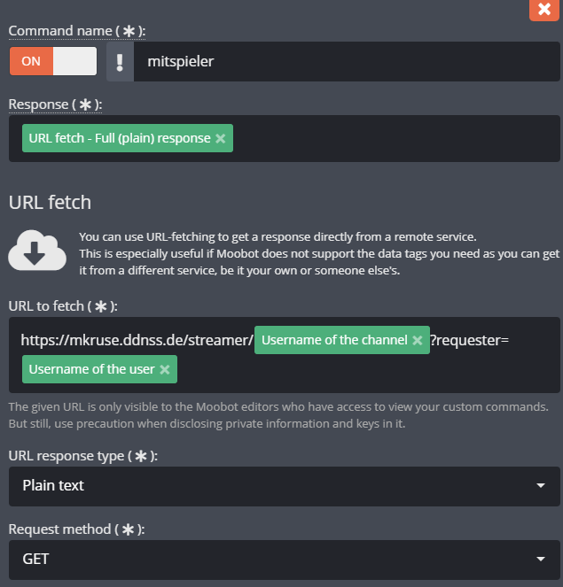
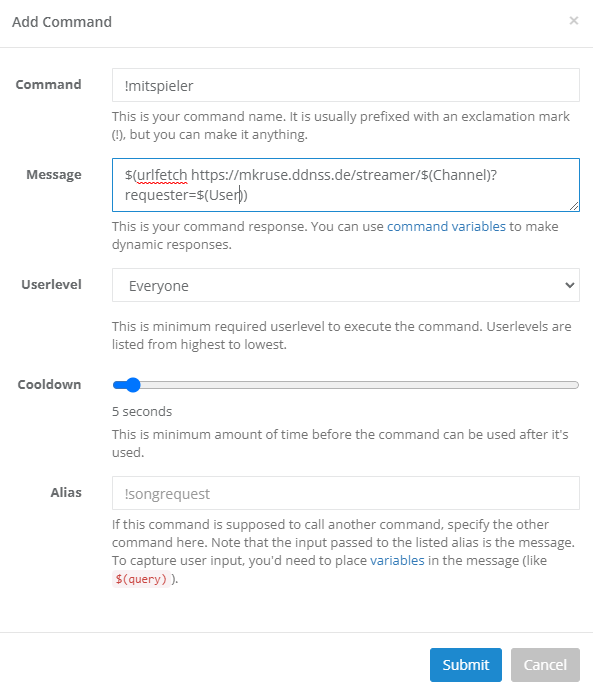

# NOT FUNCTIONAL ANYMORE!!!

# Mitspieler Bot

This webserver provides endpoints, currently used by [Agurin](https://twitch.tv/agurin)

## Getting Started

> docker-compose up

To start the fetcher, i recommend using cron to start the service as follows:

> 0 0 0 * * cd <my_path> && /usr/bin/docker-compose up -d lolpros

This will start the lolpros fetcher every day at midnight.

I recommend to start this as followed

This is because sometimes the app and lolpros containers start hanging quite severely

> docker-compose up -d db
> 
> docker-compose up -d app
> 
> docker-compose up -d lolpros

## Usage

This bot supports Nightbot.

To have you or a streamer near you supported, please message BH_Lithium on twitch.

Add a command with the following syntax:

<redacted, not in use anymore>

## Credits

* <https://github.com/yuhanfang/riot>
* <https://github.com/gofiber/fiber>
